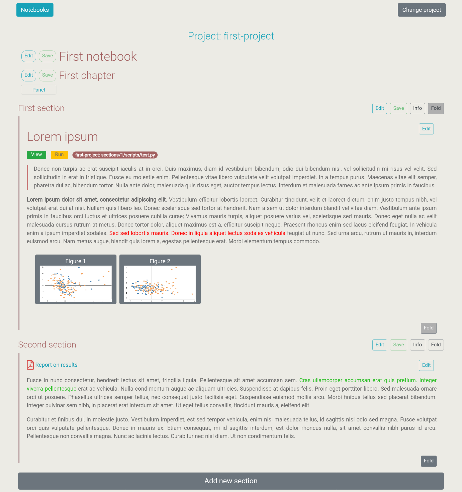
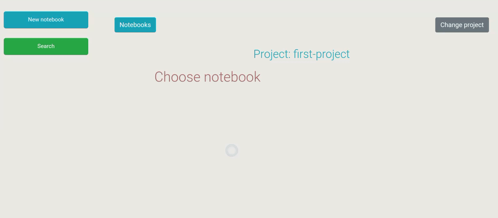
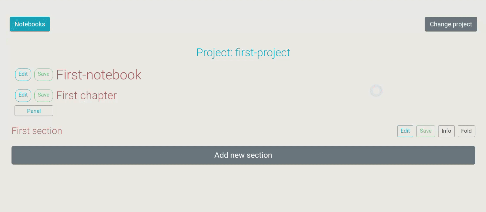
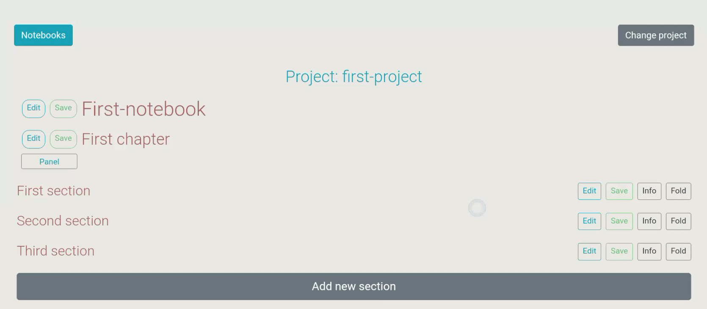
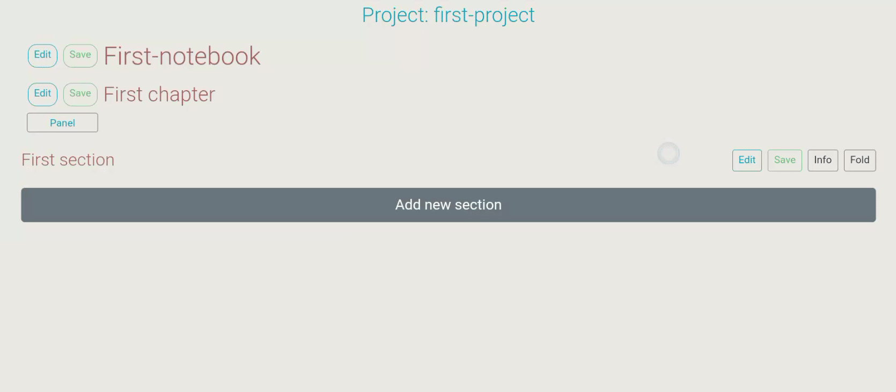
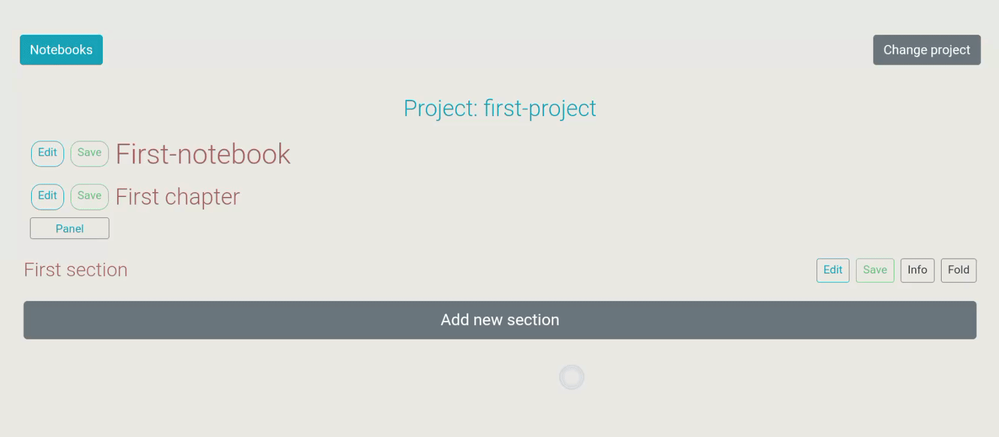

.. |br| raw:: html

    

################################################
Welcome to fresnote documentation!
################################################

.. toctree::
   :maxdepth: 3

**F**\ lask **res**\ earch **note**\ book (``fresnote``) is a browser-based note-taking application suitable for managing and organizing personal and research projects.

|br|

``fresnote`` is based on the following rationale:

* User creates **projects**.
* Each project has one or more **notebooks**.
* Each notebook has one or more **chapters**.
* Each chapter has one or more **sections**.

************************************
Installation
************************************

``fresnote`` uses Flask as backend and Bootstrap as frontend. To install ``fresnote`` run:

.. code-block:: bash

    pip install fresnote

The development and testing of ``fresnote`` has been done using ``python 3.8`` with `Flask <https://flask.palletsprojects.com/en/2.3.x/>`_ as the only dependency. Regarding the frontend, the CSS and JS libraries for `Bootsrap <https://getbootstrap.com/>`_, `Jquery <https://jquery.com/>`_, `Quill <https://quilljs.com/>`_, `Toastr <https://github.com/CodeSeven/toastr>`_, `Hightlight <https://highlightjs.org/>`_ and `Katex <https://katex.org/>`_ are included in the installation for offline usage. 

################################################
Usage
################################################

************************************
Start fresnote server
************************************

The first time you use ``fresnote``, create an empty ``.ini`` file. For example ``fresnote.ini``. Then follow the steps below everytime you want to use ``fresnote``.

1. In the command line, run:

.. code-block:: bash

   fresnote -c fresnote.ini

The above command will start the Flask server which by default will be listening at port ``5000``. You can specify different port with the ``-p`` option:

.. code-block:: bash

   fresnote -c fresnote.ini -p 8000

2. Open your preferred browser and enter the following url:

.. code-block::

    http://127.0.0.1:5000/

************************************
Create the first project
************************************

After entering the url ``http://127.0.0.1:5000/``, you will be directed to the page where you can load an existing project or create a new one. For the latter, you need to specify the **full-path** of the directory where you want the project to be stored. Keep note that in the example shown below, a project is created without specifying the full-path. Although this can be done, it is not advised since various aspects of the application will not function properly. Additionally, since a directory will be created based on the provided project name, it is suggested project names not to include whitespaces.

.. image:: images/figure_1.gif
   :width: 600
   :alt: Figure 1
   :align: center

|br|

Upon project creation, ``fresnote`` enters the following entries in the ``.ini`` file:

.. code-block::

    [first-project]
    path = first-project
    docs = first-project/docs
    uploads = first-project/uploads
    sections = first-project/sections
    db = first-project/project.db

If full-path is provided, then it is included in the ``.ini``. Additionally, ``fresnote`` creates all the directories specified in the entries ``path``, ``docs``, ``uploads`` and ``sections`` of the ``.ini``. Finally, it creates the ``sqlite`` database specified in the ``db`` entry. 

docs vs sections
====================

Whenever the user creates a new section, ``fresnote`` creates a directory in the ``sections`` named after the ID of the new section. If the user deletes a section, its directory in the ``sections`` also gets deleted. On the other hand, files that are included in the ``docs`` can be referenced by the user in various sections and do not get deleted upon section deletion.

uploads
=======

In each project an area to upload files is made available after pressing the ``Panel`` button. ``fresnote`` stores all the uploaded files in the ``uploads``.

**********************************************
Create the first notebook, chapter and section
**********************************************

Press the button ``Notebooks`` followed by the button ``New notebook``. Automatically, ``fresnote`` will create a new chapter and name it ``First chapter``. The name of the notebook and the chapter can be changed by pressing the corresponding ``Edit`` button. To add a new section to the chapter, press the ``Add new section`` button. ``fresnote`` will name the new section as ``New section`` which can be changed with the ``Edit`` button. 

|br|

************************************
Assign tags to sections
************************************

When a new section is created, ``fresnote`` assigns an ID to the section alogn with the tag ``na``. The ID can been seen by pressing the ``Info`` button.  Furthermore, the ``Info`` area includes the ``Delete section`` button and the tags area. Tags can be changed with the ``Edit`` button and are useful for creating groups of sections.

|br|

Using the section's ID, ``fresnote`` automatically creates a directory using the path specified in the ``sections`` entry of the ``.ini`` file. For instance, if a section has the ID ``1`` then ``fresnote`` will create the directory ``first-project/sections/1``. The user can include any kind of files in this directory. This allows the organization of the project into sections.  When a section is deleted, its corresponding directory is also deleted.

************************************
Reorder or include sections
************************************

By pressing the ``Panel`` button, various areas are revealed. One of this areas is called ``Add/Change order of sections``. It contains the order of the sections (if any) in the currect chapter in the form ``ID-section title``. By pressing the ``Edit`` button the user can re-order the sections or include sections from other chapters. As input only the section ID is required, whereas the section title is optional.

|br|

************************************
Add content to sections
************************************

By pressing the ``Fold`` button, the content area of the section is revealed. The fold state of the section (folded/unfoled) is registered in the database and remembered during next project loading. The section content is writen using markdown and latex style markups (see `Fresnote markups`_) and then ``fresnote`` renders the content into html.

|br|

************************************
Search for sections
************************************

By pressing the button ``Notebooks`` followed by the button ``Search`` the user is redirected to the search page. ``fresnote`` searches for the provided words in either the section title, tags or content area. 

|br|

By default ``fresnote`` creates a query joining the words with ``AND``. Thus, the following user input:

.. code-block::

   word1 word2 word3

gets translated into:

.. code-block::

   (section LIKE %word1% OR tags LIKE %word1% OR content LIKE %word1%) AND \
   (section LIKE %word2% OR tags LIKE %word2% OR content LIKE %word2%) AND \
   (section LIKE %word3% OR tags LIKE %word3% OR content LIKE %word3%) AND 

If the indicator ``or:`` is included at the beginning of the query, ``fresnote`` joins the words with ``OR``. Thus, the following user input:

.. code-block::

   or:word1 word2 word3

gets converted into:

.. code-block::

   (section LIKE %word1% OR tags LIKE %word1% OR content LIKE %word1%) OR \
   (section LIKE %word2% OR tags LIKE %word2% OR content LIKE %word2%) OR \
   (section LIKE %word3% OR tags LIKE %word3% OR content LIKE %word3%) OR 

The query can be constrained only to the section title, the tags or the content area by specifying the corresponding indicator along with the ``or`` indicator depending on whether the words should be joined with ``OR`` or not. 

.. code-block::
    
    section:word1 word2 word3    -> search only section title and join words with AND
    section-or:word1 word2 word3 -> search only section title and join words with OR
    tags:word1 word2 word3       -> search only tags area and join words with AND
    tags-or:word1 word2 word3    -> search only tags area and join words with OR
    content:word1 word2 word3    -> search only content area and join words with AND
    content-or:word1 word2 word3 -> search only content area and join words with OR

Sections can be searched based on the ID by using the ``id:`` indicator:

.. code-block::

    id:1

.. _Fresnote markups:

################################################
Fresnote markups
################################################

``fresnote`` implements markdown and latex style markups that renders to html.

************************************
Bold text
************************************

.. code-block::

    **TEXT**

************************************
Italic text
************************************

.. code-block::

    __TEXT__

************************************
Quote text
************************************

.. code-block::

    > TEXT

************************************
Headers
************************************

.. code-block::

    # Header 1
    ## Header 2
    ### Header 3
    #### Header 4

************************************
Divide content with horizontal line
************************************

.. code-block::

   PARAGRAPH 1

   ---

   PARAGRAPH 2

************************************
Color text
************************************

Mark text in red or green color:

.. code-block::

   \red{TEXT}
   \green{TEXT}

************************************
Mathematical text
************************************

Mathematical text should be writen in Latex style.
For inline math text there are two markups:

.. code-block::

   some text and $MATH INLINE 1$ and some other text.
   some text and \(MATH INLINE 2\) and some other text.

Choose one inline math markup. Do not mix the two versions of inline math.
For math equations:

.. code-block::

   $$
   MATH equation
   $$

************************************
Insert images
************************************

This markup should be placed in a new line.

.. code-block::

   \img{
    TITLE, URL, WIDTH, HEIGHT
   }

``WIDTH`` and ``HEIGHT`` are optional. If omitted the values ``200`` and ``100`` are used respectively. 
The ``URL`` can be the url of an image, or the path to an image in the current or another project. For the latter, the path should be writen as:

.. code-block::

   /PROJECT/DIRECTORY/IMAGE

Pay attention to the leading ``/`` before the ``PROJECT``. If omitted the link will not function.
The ``DIRECTORY`` should be ``docs``, ``uploads`` or ``sections``. For instance, to insert the image ``figure_1.jpg`` that exists in the section ``10`` of the project ``first-project``:

.. code-block::

   \img{
   Figure 1, /first-project/sections/10/figure_1.jpg, 300, 200
   }

To group images together, include them in the same ``img`` markup:

.. code-block::

   \img{
   Figure 1, /first-project/sections/10/figure_1.jpg, 300, 200
   Figure 2, /first-project/sections/10/figure_2.jpg, 300, 200
   Figure 3, /first-project/sections/10/figure_3.jpg, 300, 200
   }

************************************
Create foldable text
************************************

.. code-block::
   
    PARAGRAPH 1

    \fold{TITLE
    PARAGRAPH 2
    }

In the example above, ``PARAGRAPH 1`` will be rendered normally, whereas ``PARAGRAPH 2`` will be contained in a foldable section controlled by a button named as ``TITLE``.

************************************
Create list
************************************

List with bulletpoints:

.. code-block::

   \list{
   * Item 1
   * Item 2
   * Item 3
   }

List with numbers:

.. code-block::

   \list{
   1. Item 1
   2. Item 2
   3. Item 3
   }

Todo list:

.. code-block::

   \list{
   \todo Item 1
   \done Item 2
   \error Item 3
   }

************************************
Create a link
************************************

Create a link to external url:

.. code-block::

   \link{URL}
   \link{REFERENCE TEXT, URL}

The ``REFERENCE TEXT`` is optional. If omitted, the ``URL`` will be rendered as reference text.

Create a link to a file of the current or other project.

.. code-block::

   \link{REFERENCE TEXT, /PROJECT/DIRECTORY/PATH}

Pay attention to the leading ``/`` before the ``PROJECT``. If omitted the link will not function.
The ``DIRECTORY`` should be ``docs``, ``uploads`` or ``sections``. The ``PATH`` should be the path to a file that exists in the ``DIRECTORY``. For instance, to link the file ``file1.pdf`` that exists in the section ``10`` of the project ``first-project``, the link would be: 

.. code-block::

   \link{REFERENCE TEXT, /first-project/sections/10/file1.pdf}

If the link refers to a file with one of the following extensions:

.. code-block::

    .docx
    .doc
    .xls
    .xlsx
    .csv
    .tsv
    .tex
    .bib
    .txt

after pressing the link, the file will be opened with the default system application.

************************************
Create section views
************************************

Using the link markup, various sections of the current or other project can viewed by referring to their IDs. 

.. code-block::

   \link{REFERENCE TEXT, /PROJECT/view/IDs}

Pay attention to the leading ``/`` before the ``PROJECT``. If omitted the link will not function.
For instance, to view the sections with IDs ``1``, ``20`` and ``15`` of the project ``first-project``, the link would be:

.. code-block::

   \link{REFERENCE TEXT, /first-project/view/1,20,15}

************************************
Create table link
************************************

This markup renders a file in a table format.

.. code-block::

   \table{TITLE, PROJECT, PATH, DELIMITER}

``TITLE`` is how the link will be named when rendered. ``PATH`` should be the path of the file that exists in either ``docs``, ``uploads`` or ``sections``. ``DELIMITER`` should be ``tab``, ``comma`` or ``space``. For instance, to create a table link ``Table 1``  for the comma separated file ``table_1.csv`` that exists in the section ``26`` of the project ``first-project``:

.. code-block::

   \table{Table 1, first-project, sections/26/table_1.csv, comma}

******************************************
Include section content to another section
******************************************

Inside a section, the user can include content from another section that exists in the current or another project. The markup should be placed in a new line.

.. code-block::

   \include-section{PROJECT, ID}

************************************
Include content from a file
************************************

The content of a file will be included in a raw format. The file should exist in either ``docs``, ``uploads`` or ``sections``. The markup should be placed in a new line.

.. code-block::

   \include-file{PROJECT, PATH}

For instance, to include the contents of the file ``results.txt`` that exists in the section ``12`` of the ``first-project``:

.. code-block::

   \include-file{first-project, sections/12/results.txt}

************************************
Create link to a script
************************************

The following markup creates a link to script:

.. code-block::

   \script{PROJECT, PATH}

The markup should be placed in a new line and the script should exists in either ``docs``, ``uploads`` or ``sections``. For this markup, ``fresnote`` renders a ``View`` and a ``Run`` button. By pressing the ``View`` button, the user can see the content of the script. By pressing the ``Run`` button, ``fresnote`` executes the script. Only scripts with the extension ``.py``, ``.sh`` or ``.R`` are executed. Currently, running scripts in parallel is not supported.

.. image:: images/figure_7.gif
   :width: 600
   :alt: Figure 7
   :align: center
